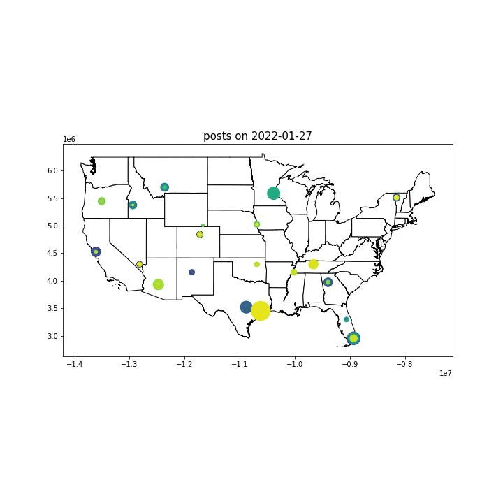

# location_subreddit_activity
Timeseries analysis / visualizations  

Notebooks + UI  
Learning more about GeoJSON, eventually MapBox for GIS tile-rendering.  
<h4> in progress: </h4>
Data gathered from Reddit / Pushshift / GeoDB / Wikidata APIs will power NextJS UI w/ Dark Sky-esque time slider. When hovering over a location, a tooltip will show additional data (e.g population, reddit activity stats).  
A secondary panel will display a horizontal stacked bar chart ranking subreddit locations by different data features over time (e.g comments/posts per day).  

